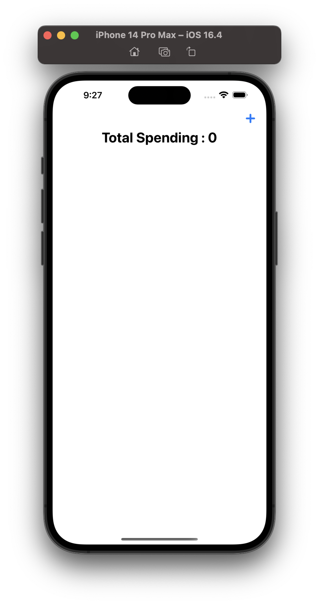
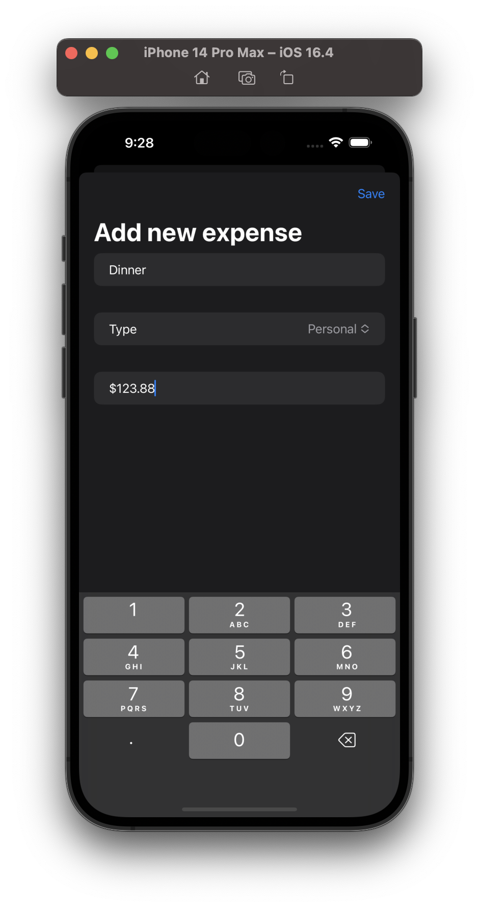
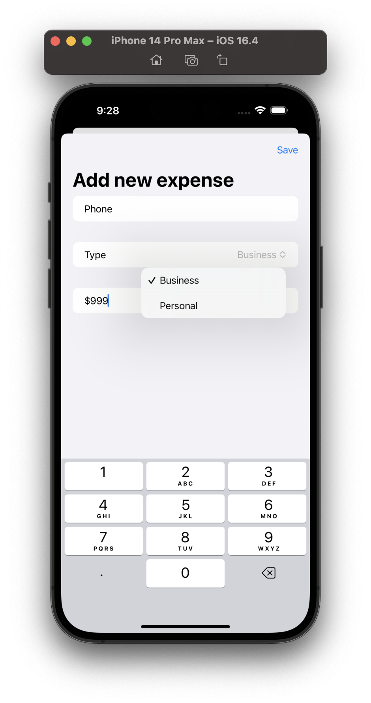
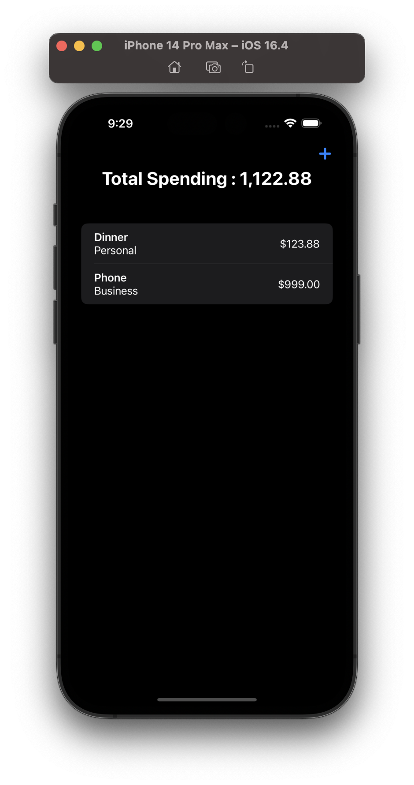

# IExpense

 It is an expense tracker that separates personal costs from business costs. At its core this is an app with a form (how much did you spend?) and a list (here are the amounts you spent).

## Screenshots

